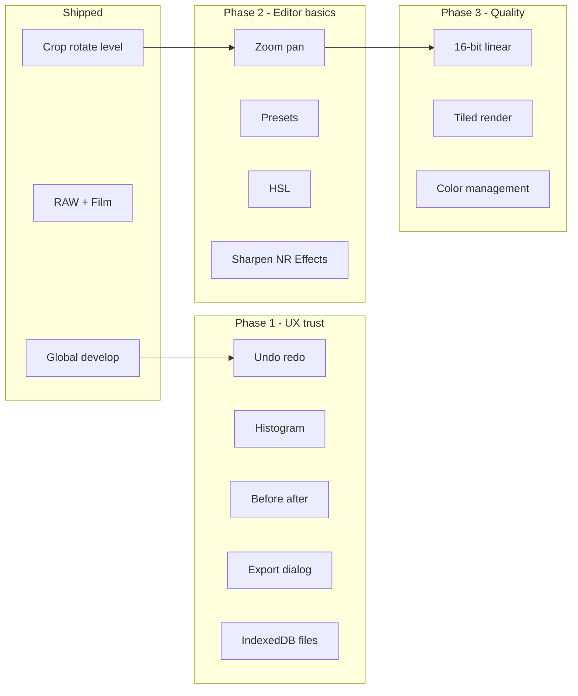

# Photo — Feature roadmap

A prioritized plan for what to build next, based on a codebase review and typical photo-editor expectations. Items reflect the app as of the multi-photo filmstrip era (RAW develop, film stocks, transform tools, localStorage settings).

**Legend:** ✅ Done · 🚧 In progress · ⬜ Planned

---

## What exists today

| Area | Status |
|------|--------|
| Import (JPEG/PNG/WebP/AVIF + RAW), drag-and-drop, multi-file | ✅ |
| Light / Color sliders, interactive tone curve | ✅ |
| Film stock emulations (Portra, Velvia, Tri-X, CineStill) | ✅ |
| RAW develop (denoise, auto brightness, demosaic) | ✅ |
| Multi-photo filmstrip, per-photo settings, apply to all | ✅ |
| Session persistence (adjustments + RAW settings in `localStorage`) | ✅ |
| Export single + batch JPEG at processed resolution | ✅ |
| Crop, rotate (90°), level / straighten | ✅ |
| WebGL preview pipeline (8-bit, single pass) | ✅ |

**Structural limits today:** 8-bit textures, no linear color, no ICC, GPU texture size caps on huge RAWs, no undo, image pixels are not persisted (files must be re-opened after refresh).

---

## Tier 1 — High impact, fits the current stack

Address the biggest UX gaps without rewriting the app.

| # | Feature | Why | Effort |
|---|---------|-----|--------|
| 1 | **Undo / redo** | Users expect to experiment safely; store a stack of `Adjustments` snapshots per photo; Cmd+Z / Cmd+Shift+Z | Small |
| 2 | **Histogram + clipping indicators** | Pairs with Light sliders; luminance/RGB from downsampled pixels or readback | Small–medium |
| 3 | **Before / after** | Hold key or toggle to render `DEFAULT_ADJUSTMENTS` while keeping edited state; no new pipeline | Small |
| 4 | **Export options** | `exportImage` already supports PNG MIME; add format (JPEG/PNG/WebP), quality, optional max long edge | Small |
| 5 | **Persist photos across sessions** | **IndexedDB** for file blobs + optional **File System Access API**; removes “re-open files” friction | Medium |
| 6 | **Presets** | Serialize `{ adjustments, film, curve, geometry }`; built-ins + save/load custom; extends “apply to all” | Medium |

**Suggested first three:** undo/redo → presets + before/after → IndexedDB persistence.

---

## Tier 2 — Core editor features

| # | Feature | Status | Notes |
|---|---------|--------|-------|
| 7 | **Crop, rotate, flip** | ✅ | Shader UV transform; crop mode with handles; level slider; aspect presets |
| 8 | **Zoom and pan** | ⬜ | Wheel zoom, drag pan, fit / 100% — essential for sharpness/noise checks |
| 9 | **HSL** (hue / saturation / luminance) | ⬜ | Per-hue wheels or simplified orange/green/blue sliders in shader |
| 10 | **Sharpen + display noise reduction** | ⬜ | GPU unsharp mask + luminance NR after develop (not only RAW decode-time FBDD) |
| 11 | **Effects panel** | ⬜ | Vignette, adjustable grain, optional dehaze; complements film stocks |
| 12 | **EXIF / metadata panel** | ⬜ | ISO, focal length, camera, date — context for noise and exposure |

---

## Tier 3 — Pro RAW / image quality

Matches README technical caveats; unlocks Lightroom-adjacent quality.

| # | Feature | Why | Effort |
|---|---------|-----|--------|
| 13 | **16-bit / linear pipeline** | Half-float textures (WebGL2 `rgba16f` or extensions); develop in linear, encode at display | Large |
| 14 | **Parametric RAW (non-destructive develop)** | Keep RAW bytes + settings; avoid baking to 8-bit until export; pairs with #13 | Large |
| 15 | **Tiled decode / render** | For 50+ MP and `MAX_TEXTURE_SIZE` limits on preview and export | Large |
| 16 | **Color management** | ICC input, working space, display transform | Large |

---

## Tier 4 — Lightroom-class (long horizon)

| Feature | Why it’s hard |
|---------|----------------|
| **Local adjustments** (brush, radial, gradient) | Mask textures, masked shader passes, heavy UI |
| **Lens corrections** | Profile database, geometry, crop integration |
| **Catalog / DAM** | Folders, search, ratings, keywords, smart collections |
| **Snapshots & history panel** | Named versions beyond undo; side-by-side compare |
| **AI** (auto mask, denoise) | Model size, WASM/GPU budget, product scope |

Build after global develop, geometry, persistence, and undo are solid.

---

## Quick wins (days, not weeks)

- [ ] PNG export in the UI (API already supports it)
- [ ] “Clear session” button wired to `clearCatalog()`
- [ ] Keyboard shortcuts (export, reset, filmstrip prev/next)
- [ ] Copy settings to **selected** photos (not only all)
- [ ] Update README (filmstrip, film, RAW panel, transform, persistence)
- [ ] Filmstrip tooltips / filename on hover
- [ ] Auto-enhance one-shot (heuristic preset or mild auto-levels)
- [ ] Flip horizontal / vertical (geometry extension)

---

## Phased roadmap

| Phase | Goal | Deliverables |
|-------|------|----------------|
| **Now** | Credible develop + compose | Sliders, curve, RAW, film, transform ✅ |
| **Phase 1** | Trustworthy daily driver | Undo, histogram, before/after, export dialog, file persistence |
| **Phase 2** | Matches basic photo apps | Zoom/pan, presets, HSL, sharpen/NR, effects, EXIF |
| **Phase 3** | Competitive RAW quality | 16-bit linear, parametric RAW, tiling, ICC |

---

## Implementation notes (when picking up a item)

### Undo / redo
- Zustand middleware or per-photo `history: Adjustments[]` + `historyIndex`
- Debounce pushes for slider drags (e.g. coalesce within 300ms)
- Include `geometry`, `film`, `curve` in each snapshot

### Histogram
- Downsample `DecodedImage` or GPU readback after render
- Canvas or SVG bars under viewport; optional R/G/B toggle
- Clipping: count pixels at 0 and 255

### IndexedDB persistence
- Store `File` blobs keyed by `fingerprint`
- On load, hydrate `sourceFile` from IDB so catalog works after refresh
- Cap total storage; LRU eviction policy

### HSL in shader
- `rgb2hsv` / `hsv2rgb` already in `shaders.ts`
- Add uniforms for hue shifts and sat/lum per wedge (6 or 8 hues)
- Keep one fragment pass if possible

### 16-bit linear migration
- WebGL2 + `EXT_color_buffer_float` or half-float textures
- Decode RAW at 16-bit; curve in linear; tone map at end
- Biggest breaking change — plan a feature flag

---

## What to build first (opinionated short list)

1. **Undo / redo** — unblocks experimentation on everything else  
2. **Presets + before / after** — showcases film + sliders; strong demos  
3. **IndexedDB persistence** — makes the multi-photo catalog actually stick  
4. **Histogram + export options** — professional feel with modest effort  
5. **Zoom / pan** — pairs with crop and RAW noise review  

Then invest in **16-bit linear** when ready for a larger technical bet.

---

## References

- In-app caveats: `README.md` → Known caveats / next steps  
- Architecture: `src/editor/pipeline.ts`, `shaders.ts`, `state/store.ts`, `persistence.ts`
